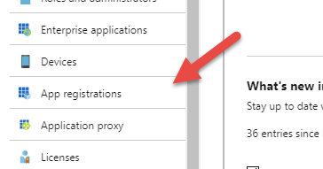
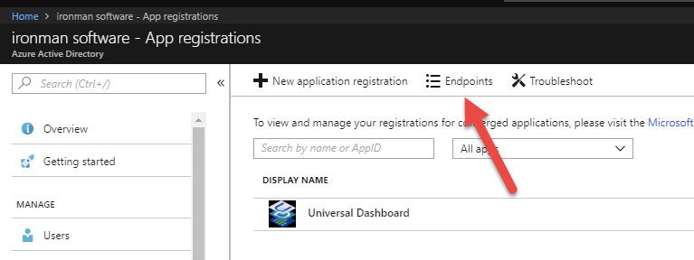
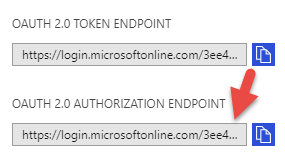

# AzureAD


Not available in Community Edition. 


You can use `New-UDAuthenticationMethod` to configure Azure Active Directory authentication.

## Registering Your Application

You'll first need to register your application in the portal. In your directory settings, click App registrations.



Create a new application. You can provide your signin URL and application name.

You'll need to configure your Reply URLs to point back to your UD instance. The URL should be: `http(s)://<server:port>/signin-oidc`.


You'll also want to make note of your application ID and your tenant ID. Your application ID is listed directly on the Registered Applications page.

The tenant ID is available by navigating to the App Registrations page that lists all your applications and clicking Endpoints.



The tenant ID is in the URL of all the endpoints.



## Configuring UD for AzureAD

All you need to do is provide the above information to `New-UDAuthenticationMethod`.

```text
#ClientId -eq ApplicationId
$AuthenticationMethod = New-UDAuthenticationMethod -ClientId '000000-000-0000-0000-00000' -Instance https://login.microsoftonline.com -Domain ironmansoftware.onmicrosoft.com -TenantId '00000-0000-0000-000-00000000'

$LoginPage = New-UDLoginPage -AuthenticationMethod $AuthenticationMethod
```

