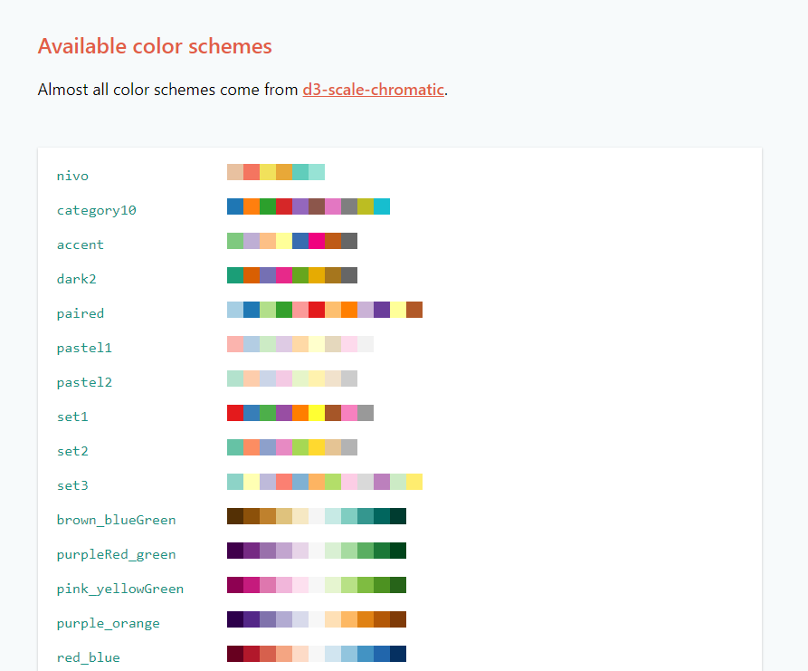
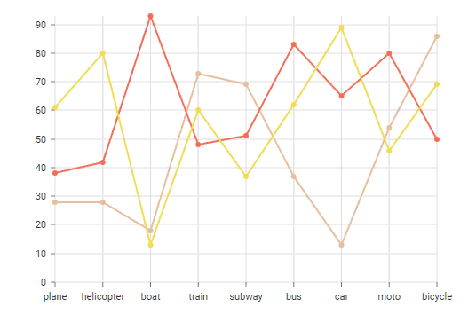
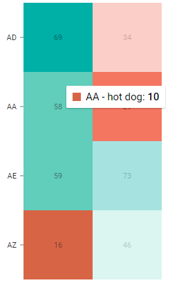
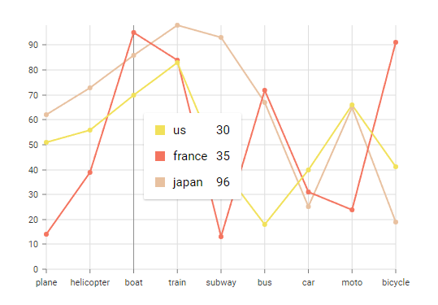
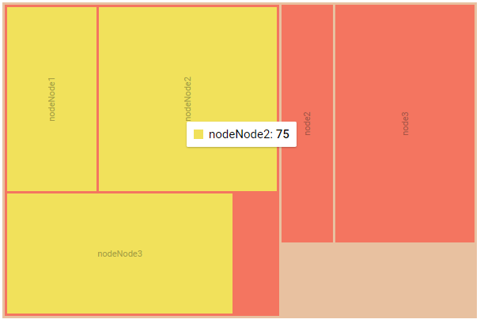

# New Enterprise Charts

Universal Dashboard 2.2.0-beta2 adds support for [Nivo](http://nivo.rocks/) charts. This chart library is built on React and D3 to provide highly configurable and beautiful data visualizations . In addition to the standard charts, such as bar and line charts, there are also new chart types such as calendar and treemap. 

You can access all the charts with a single cmdlet: `New-UDNivoChart`. This cmdlet exposes an extensive amount of configurable parameters for your charts. 

## New Color Options

Nivo charts provides 50 built in color palettes to use with your charts. You can set the `-Colors` parameter on your chart to set your color palette. Additionally, you can provide color data directly with the data in your chart rather than having to provide a separate array of colors. 

For more information on colors, visit the [Nivo color documentation](http://nivo.rocks/guides/colors). 



## Fill Patterns 

In addition to custom colors, you can also define fill patterns for your chart components. You can define lines or dots and choose the corresponding colors. 

```
$Pattern = New-UDNivoPattern -Dots -Id 'dots' -Background "inherit" -Color "#38bcb2" -Size 4 -Paddin 1 -Stagger
$Fill = New-UDNivoFill -ElementId "hot dog" -PatternId 'dots'
```


## Interative Charts

Nivo charts support `-onClick` event handlers. You can provide a script block and when the chart is clicked, it will be invoked with the `$EventData` variable populated with the JSON representation of the data that was clicked within the chart. 

```
-OnClick {
    Show-UDToast -Message $EventData -Duration 3000
}
```


## Differences between `New-UDChart`

### No Auto Refresh

The Nivo chart cmdlet doesn't expose an `-Endpoint` or `-AutoRefresh` parameter directly. That said, it's still possible to auto refresh by putting the chart within a a layout element, like a column, with autorefresh settings enabled and setting the `-Id` of the chart to anything. 

```
 New-UDColumn -SmallSize 6 -AutoRefresh -RefreshInterval 5 -Endpoint {
    New-UDHeading -Text "Line" -Size 4
    New-UDHeading -Text "A standard line chart."

    New-UDNivoChart  -Id 'lineChart' -Line -Data $Cache:Data -Height 400 -Width 600 -MarginBottom 50 -MarginTop 50 -MarginRight 110 -MarginLeft 60 -OnClick {
        Show-UDToast -Message $EventData -Duration 3000
    }

} 
```




### No Out-UDChartData

Data can be provided to the charts directly through the `-Data` parameter rather than having to be piped through a cmdlet like `Out-UDChartData`. The reason for this is that each type of chart expects different types of data structures. 

Each of these data structures are defined within the Nivo examples but will also be defined within the UD documentation when 2.2 is released. 

Click the [data tab](http://nivo.rocks/bar) for an example. You can define a hashtable that matches the structure of the JSON and it will be automatically serialized for your. 

## Chart Types 

### Bar 

Just as with `New-UDChart`, the standard bar chart is available. It easily supports multiple datasets and can be stacked, grouped or layed outed horizontally. 

Here is an example of a bar chart. 

```
$Pattern = New-UDNivoPattern -Dots -Id 'dots' -Background "inherit" -Color "#38bcb2" -Size 4 -Paddin 1 -Stagger
$Fill = New-UDNivoFill -ElementId "hot dog" -PatternId 'dots'

New-UDNivoChart -Bar -Id 'barChart' -Data @(
    @{
        country = "AD"
        "hot dog" = (Get-Random -Maximum 100 -Minimum 10)
        "hot dogColor" = "hsl(313, 70%, 50%)"
        "burger" = (Get-Random -Maximum 100 -Minimum 10)
        "burgerColor" = "hsl(102, 70%, 50%)"
    }
    @{
        country = "AA"
        "hot dog" = (Get-Random -Maximum 100 -Minimum 10)
        "hot dogColor" = "hsl(313, 70%, 50%)"
        "burger" = (Get-Random -Maximum 100 -Minimum 10)
        "burgerColor" = "hsl(102, 70%, 50%)"
    }
    @{
        country = "AE"
        "hot dog" = (Get-Random -Maximum 100 -Minimum 10)
        "hot dogColor" = "hsl(313, 70%, 50%)"
        "burger" = (Get-Random -Maximum 100 -Minimum 10)
        "burgerColor" = "hsl(102, 70%, 50%)"
    }
    @{
        country = "AZ"
        "hot dog" = (Get-Random -Maximum 100 -Minimum 10)
        "hot dogColor" = "hsl(313, 70%, 50%)"
        "burger" = (Get-Random -Maximum 100 -Minimum 10)
        "burgerColor" = "hsl(102, 70%, 50%)"
    }
) -Keys @("hot dog", "burger") -IndexBy "country" -Height 400 -Width 600 -colors 'nivo' -Definitions $Pattern -Fill $fill -OnClick {
    Show-UDToast -Message $EventData -Duration 3000
}
```


### Calendar 

The calendar chart, as usually seen on GitHub, is a good way to represent data volume over time. 

```
New-UDNivoChart -Calendar  -Id 'calendarChart' -Data @(
    1..90 | % {
        @{
            day = (Get-Date).AddDays($_ * -1).ToString("yyyy-MM-dd")
            value = (Get-Random -Minimum 1 -Maximum 400)
        }
    } 
)  -From (Get-Date).AddDays(-90) -To (Get-Date) -Width 600 -Height 400 -MarginTop 50 -MarginRight 10 -MarginLeft 50 -MarginBottom 10 -OnClick {
    Show-UDToast -Message $EventData -Duration 3000
}
```


### Heatmap

A heatmap shows squares with different color based on the intensity of the data relative to its peers. 

```
$Data = @(
    @{
        country = "AD"
        "hot dog" = (Get-Random -Maximum 100 -Minimum 10)
        "hot dogColor" = "hsl(102, 70%, 50%)"
        "burger" = (Get-Random -Maximum 100 -Minimum 10)
        "burgerColor" = "hsl(102, 70%, 50%)"
    }
    @{
        country = "AA"
        "hot dog" = (Get-Random -Maximum 100 -Minimum 10)
        "hot dogColor" = "hsl(102, 70%, 50%)"
        "burger" = (Get-Random -Maximum 100 -Minimum 10)
        "burgerColor" = "hsl(102, 70%, 50%)"
    }
    @{
        country = "AE"
        "hot dog" = (Get-Random -Maximum 100 -Minimum 10)
        "hot dogColor" = "hsl(102, 70%, 50%)"
        "burger" = (Get-Random -Maximum 100 -Minimum 10)
        "burgerColor" = "hsl(102, 70%, 50%)"
    }
    @{
        country = "AZ"
        "hot dog" = (Get-Random -Maximum 100 -Minimum 10)
        "hot dogColor" = "hsl(102, 70%, 50%)"
        "burger" = (Get-Random -Maximum 100 -Minimum 10)
        "burgerColor" = "hsl(102, 70%, 50%)"
    }

)
New-UDNivoChart  -Id 'heatmapChart' -Heatmap -Data $data  -Keys @("hot dog", "burger") -IndexBy "country" -ForceSquare -Height 400 -Width 600 -OnClick {
    Show-UDToast -Message $EventData -Duration 3000
}
```



### Line Chart

A standard line chart that easily supports multiple datasets. 

```
New-UDNivoChart  -Id 'lineChart' -Line -Data @(
    @{
        "id"= "japan"
        "color" = "hsl(272, 70%, 50%)"
        "data" = @(
            @{
                "x" = "plane"
                "y" = (Get-Random -Maximum 100 -Minimum 10)
            }
            @{
                "x" = "helicopter"
                "y" = (Get-Random -Maximum 100 -Minimum 10)
            }
            @{
                "x" = "boat"
                "y" = (Get-Random -Maximum 100 -Minimum 10)
            }
            @{
                "x" = "train"
                "y" = (Get-Random -Maximum 100 -Minimum 10)
            }
            @{
                "x" = "subway"
                "y" = (Get-Random -Maximum 100 -Minimum 10)
            }
            @{
                "x" = "bus"
                "y" = (Get-Random -Maximum 100 -Minimum 10)
            }
            @{
                "x" = "car"
                "y" = (Get-Random -Maximum 100 -Minimum 10)
            }
            @{
                "x" = "moto"
                "y" = (Get-Random -Maximum 100 -Minimum 10)
            }
            @{
                "x" = "bicycle"
                "y" = (Get-Random -Maximum 100 -Minimum 10)
            }
        )
    }
    @{
        "id"= "france"
        "color" = "hsl(244, 70%, 50%)"
        "data" = @(
            @{
                "x" = "plane"
                "y" = (Get-Random -Maximum 100 -Minimum 10)
            }
            @{
                "x" = "helicopter"
                "y" = (Get-Random -Maximum 100 -Minimum 10)
            }
            @{
                "x" = "boat"
                "y" = (Get-Random -Maximum 100 -Minimum 10)
            }
            @{
                "x" = "train"
                "y" = (Get-Random -Maximum 100 -Minimum 10)
            }
            @{
                "x" = "subway"
                "y" = (Get-Random -Maximum 100 -Minimum 10)
            }
            @{
                "x" = "bus"
                "y" = (Get-Random -Maximum 100 -Minimum 10)
            }
            @{
                "x" = "car"
                "y" = (Get-Random -Maximum 100 -Minimum 10)
            }
            @{
                "x" = "moto"
                "y" = (Get-Random -Maximum 100 -Minimum 10)
            }
            @{
                "x" = "bicycle"
                "y" = (Get-Random -Maximum 100 -Minimum 10)
            }
        )
    }
    @{
        "id"= "us"
        "color" = "hsl(94, 70%, 50%)"
        "data" = @(
            @{
                "x" = "plane"
                "y" = (Get-Random -Maximum 100 -Minimum 10)
            }
            @{
                "x" = "helicopter"
                "y" = (Get-Random -Maximum 100 -Minimum 10)
            }
            @{
                "x" = "boat"
                "y" = (Get-Random -Maximum 100 -Minimum 10)
            }
            @{
                "x" = "train"
                "y" = (Get-Random -Maximum 100 -Minimum 10)
            }
            @{
                "x" = "subway"
                "y" = (Get-Random -Maximum 100 -Minimum 10)
            }
            @{
                "x" = "bus"
                "y" = (Get-Random -Maximum 100 -Minimum 10)
            }
            @{
                "x" = "car"
                "y" = (Get-Random -Maximum 100 -Minimum 10)
            }
            @{
                "x" = "moto"
                "y" = (Get-Random -Maximum 100 -Minimum 10)
            }
            @{
                "x" = "bicycle"
                "y" = (Get-Random -Maximum 100 -Minimum 10)
            }
        )
    }
    ) -Height 400 -Width 600 -MarginBottom 50 -MarginTop 50 -MarginRight 110 -MarginLeft 60 -OnClick {
    Show-UDToast -Message $EventData -Duration 3000
    }
```



### Pie

Pie chart with numerous configuration options and the ability to create donut charts. 

```
 New-UDNivoChart -Id 'pieChart' -Pie -Data @(
    @{
        id = 'python'
        label = 'python'
        value = (Get-Random -Maximum 100 -Minimum 10)
        color = "hsl(52, 70%, 50%)"
    }
    @{
        id = 'powershell'
        label = 'powershell'
        value = (Get-Random -Maximum 100 -Minimum 10)
        color = "hsl(307, 70%, 50%)"
    }
    @{
        id = 'make'
        label = 'make'
        value = (Get-Random -Maximum 100 -Minimum 10)
        color = "hsl(161, 70%, 50%)"
    }
    @{
        id = 'scala'
        label = 'scala'
        value = (Get-Random -Maximum 100 -Minimum 10)
        color = "hsl(206, 70%, 50%)"
    }
    @{
        id = 'ruby'
        label = 'ruby'
        value = (Get-Random -Maximum 100 -Minimum 10)
        color = "hsl(145, 70%, 50%)"
    }
)  -Height 400 -Width 600 -MarginBottom 50 -MarginTop 50 -MarginRight 110 -MarginLeft 60 -InnerRadius 0.5 -PadAngle 0.7 -CornerRadius 3 -OnClick {
    Show-UDToast -Message $EventData -Duration 3000
}
```


### Stream

Stream charts provide a good representation of event data volume as it comes into a system. 

```
New-UDNivoChart -id 'streamChart' -Stream -Data @(
    @{
        "Adam" = (Get-Random -Minimum 10 -Maximum 100)
        "Bill" = (Get-Random -Minimum 10 -Maximum 100)
        "Frank" = (Get-Random -Minimum 10 -Maximum 100)
    }
    @{
        "Adam" = (Get-Random -Minimum 10 -Maximum 100)
        "Bill" = (Get-Random -Minimum 10 -Maximum 100)
        "Frank" = (Get-Random -Minimum 10 -Maximum 100)
    }                    
    @{
        "Adam" = (Get-Random -Minimum 10 -Maximum 100)
        "Bill" = (Get-Random -Minimum 10 -Maximum 100)
        "Frank" = (Get-Random -Minimum 10 -Maximum 100)
    }                    
    @{
        "Adam" = (Get-Random -Minimum 10 -Maximum 100)
        "Bill" = (Get-Random -Minimum 10 -Maximum 100)
        "Frank" = (Get-Random -Minimum 10 -Maximum 100)
    }
) -Keys @("Adam", "Bill", "Frank") -Height 400 -Width 600 -OnClick {
    Show-UDToast $EventData -Duration 3000
}           
```


### Treemap

Provides a breakdown of data in a tree format. Good for visualizing things like the size of a folder structure. (think [WinDirStat](https://windirstat.net/))

```
$ChartData = @{
    name = 'root'
    color = 'hsl(344, 70%, 50%)'
    cost = (Get-Random -Maximum 100 -Minimum 10)
    children = @(
        @{
        name = 'node1'
        color = "hsl(246, 70%, 50%)"
        cost = (Get-Random -Maximum 100 -Minimum 10)
        children = @(                  
            @{
                name = 'nodeNode1'
                color = "hsl(120, 70%, 50%)"
                cost = (Get-Random -Maximum 100 -Minimum 10)
            }
            @{
                name = 'nodeNode2'
                color = "hsl(120, 70%, 50%)"
                cost = (Get-Random -Maximum 100 -Minimum 10)
            }
            @{
                name = 'nodeNode3'
                color = "hsl(120, 70%, 50%)"
                cost = (Get-Random -Maximum 100 -Minimum 10)
            }
        )
        }
        @{
        name = 'node2'
        color = "hsl(246, 70%, 50%)"
        cost = (Get-Random -Maximum 100 -Minimum 10)
        }
        @{
        name = 'node3'
        color = "hsl(246, 70%, 50%)"
        cost = (Get-Random -Maximum 100 -Minimum 10)
        }
    )
    }

New-UDNivoChart -Id 'treemapChart' -Treemap -Data $ChartData -Identity 'name' -Value 'cost' -InnerPadding 3 -OuterPadding 3 -Height 400 -Width 600 -OnClick {
    Show-UDToast -Message $EventData -Duration 3000
}
```

